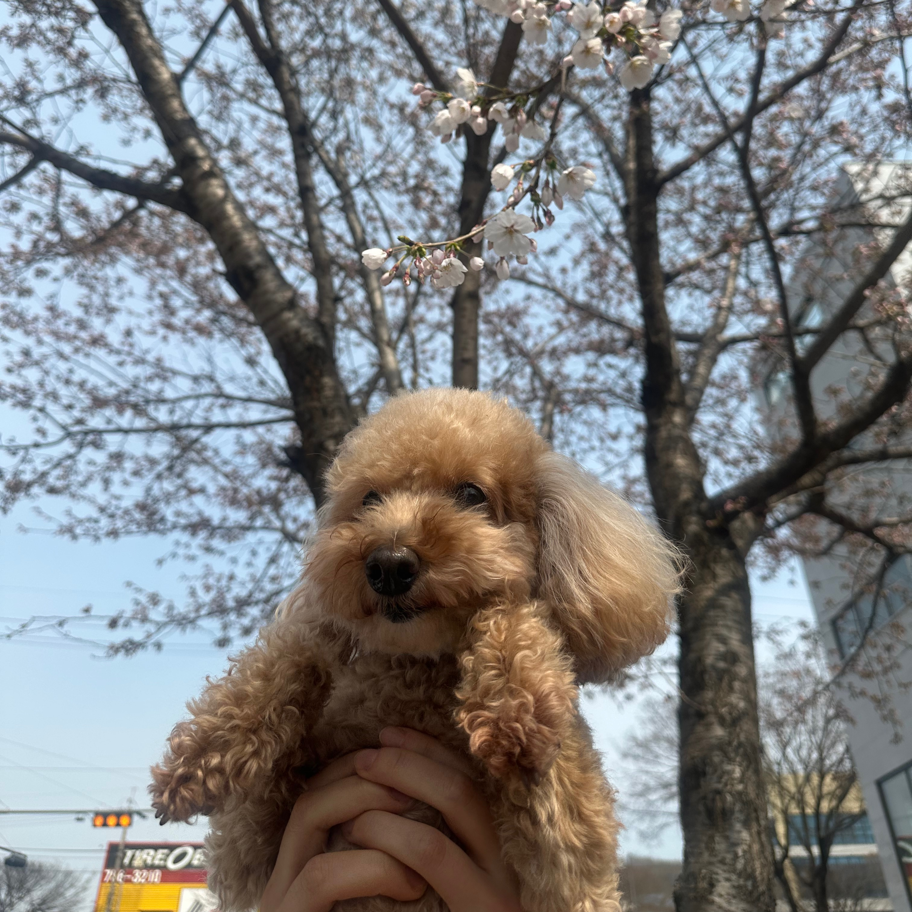

# 🐾 무슨 생각 하냥? (Pet Interpreter)
> **Kanana-o Omni API**를 활용한 멀티모달 반려동물 속마음 해석기

## 🌟 Project Overview
본 프로젝트는 카카오 **Kanana-o API 베타테스트**의 일환으로 제작되었습니다.
반려동물 사진 한 장을 업로드하면, AI가 표정·자세·환경을 분석하여 동물의 시점에서 현재 기분을 **텍스트**와 **음성**으로 들려주는 멀티모달 AI 서비스입니다.

## 🚀 Key Features
| 기능 | 설명 |
|------|------|
| 📸 Vision Analysis | 반려동물의 표정, 자세, 주변 환경 인식 |
| 🧠 Emotional Reasoning | 기쁨 / 삐짐 / 당황 / 평온 / 간절 5가지 감정 분류 |
| 💬 Persona Speech | 개는 `~멍!`, 고양이는 `~냥.` 말투로 1인칭 대사 생성 |
| 🔊 Voice Synthesis | Kanana-o TTS로 반려동물 목소리 생성 및 즉시 재생 |

## 🛠 Tech Stack
- **AI Model**: Kanana-o Omni API (Kakao Cloud)
- **Frontend**: Streamlit
- **Language**: Python 3.10+
- **Libraries**: openai, Pillow, python-dotenv

## 왜 만들었냐면...
현생에 지쳐 힐링 서비스를 만들어 보고자 했습니다. 제 강아지 귀엽죠! 