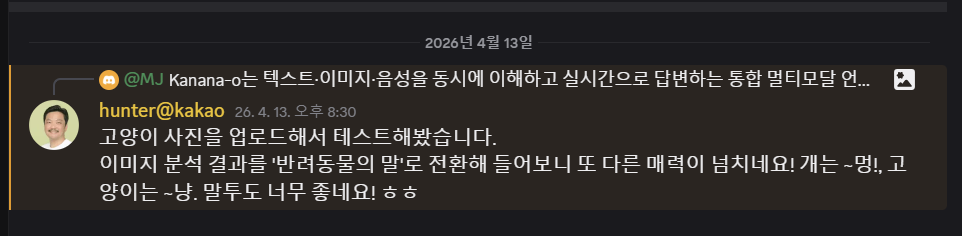

# 🐾 무슨 생각 하냥? (Pet Interpreter)

  

> 반려동물 사진 한 장으로  
> “지금 무슨 생각 중일까?”를 상상해보는 멀티모달 AI 서비스

**Kanana-o API 베타테스터 프로젝트**로 제작한  
사용자 경험 중심의 멀티모달 AI 서비스 프로젝트입니다.

---

## 프로젝트 소개

**“반려동물 속마음을 AI가 대신 말해준다면 어떨까?”**

이 프로젝트는 반려동물 사진을 바탕으로 표정과 분위기를 해석하고 감정을 추정한 뒤, 강아지/고양이 페르소나 말투로 **텍스트와 음성을 함께 생성하는 멀티모달 AI 서비스**입니다.

> **"더욱 똑똑하게 답하며, 더욱 풍부한 감정표현을 향한 Kanana-o"**

라는 슬로건에 맞춰,  
Kanana-o만이 가진 **멀티모달 응답과 감정 표현 강점**을 서비스 경험 안에 자연스럽게 녹여보고자 했습니다.

단순 이미지 분석보다, 사용자가 실제로 **귀엽고 자연스럽다고 느끼는 AI 경험**을 만드는 데 집중했습니다.

프로젝트를 진행하며 **AI 응답 자연스러움 평가**, **페르소나 일관성 테스트**, **Prompt Engineering 반복 개선**, **사용자 경험 중심 응답 품질 조정** 과정을 경험할 수 있었습니다.

---

## 서비스 링크

👉 **[https://kanana-pet-interpreter.streamlit.app](https://kanana-pet-interpreter.streamlit.app)**

> ⚠️ API 호출 한도가 있어 응답이 느리거나 오류가 발생할 수 있습니다.

---

## 서비스 실행 영상

반려동물 사진 업로드부터  
AI 감정 해석, `~멍!` / `~냥.` 대사 생성,  
음성 출력까지 실제 실행 화면입니다.

특히 `"간절"` 감정을 반영한 음성 표현을 통해  
Kanana-o 모델의 감정 표현과 페르소나 응답을 확인할 수 있습니다.

https://github.com/user-attachments/assets/8b76c099-df89-4bd7-910f-0473b91ac1ce

---

## 베타테스트 피드백

  

  
  카카오 크루분께 “이미지 분석 결과를 반려동물의 말로 전환해 들어보니 또 다른 매력이 느껴진다”는 피드백을 받을 수 있었습니다.
  

---

## 핵심 기능

| 기능 | 설명 |
|---|---|
| 이미지 감정 분석 | 반려동물의 표정·자세·배경 분위기 해석 |
| 페르소나 대사 생성 | 강아지는 `~멍!`, 고양이는 `~냥.` 말투 생성 |
| 감정 기반 말투 변화 | 기쁨 / 삐짐 / 당황 / 평온 / 간절 감정 반영 |
| Text + Audio 동시 생성 | 동일 응답에서 텍스트와 음성을 함께 생성 |
| 멀티모달 경험 설계 | 화면 텍스트와 음성의 일관성 유지 |

---

## Prompt Engineering & UX 개선 과정

프로젝트를 진행하며 Prompt를 반복적으로 수정했습니다.

### 1. 긴 응답에서 페르소나 붕괴

자유 생성 방식에서는 응답이 길어질수록 `~멍!`, `~냥.` 말투 일관성이 쉽게 무너졌습니다.

> 첫 문장은 강아지 말투인데 뒤 문장은 **일반 설명체**로 바뀌거나, **감정 표현이 어색하게 반복**되는 현상이 자주 발생했습니다.

### 2. Few-shot Prompt 추가

삐진 강아지, 귀찮은 고양이 같은 예시 대사를 **few-shot**으로 추가해 말투 패턴을 더 안정적으로 유도했습니다.

이후 반복적으로 테스트를 진행하면서, 초반 문장만 캐릭터 말투를 유지하고 후반부에서 일반 설명체로 바뀌는 현상이 이전보다 줄어드는 것을 확인할 수 있었습니다.

### 3. 말투 제약 + 후처리 적용

문장 ending 제한과 응답 길이 제약을 추가했고, 최종적으로 `_enforce_pet_ending()` 후처리를 통해 페르소나 일관성을 한 번 더 보정했습니다.

여러 입력 상황으로 테스트를 계속해서 진행하며, 감정 표현이 과하게 반복되거나 말투가 중간에 깨지는 문제를 수정해나갔습니다.

### 4. 자연스러움 vs Consistency Trade-off

Consistency를 강하게 제한하면 응답이 부자연스러워지고, 자연스러움을 우선하면 캐릭터성이 약해진다는 점이 보였습니다.

결국 최종적으로는

> 단순 정보 전달보다, **감정 표현과 캐릭터 일관성을 우선하는 방향**

으로 서비스를 개선했습니다.

왜냐하면 이 서비스에서 중요한 건 “정확한 분석”보다

- 귀엽다고 느껴지는 경험
- 반려동물과 대화하는 느낌
- 캐릭터 몰입감

이라고 판단했기 때문입니다.

---

## 이 프로젝트를 통해 느낀 점

여러 번의 테스트를 진행하면서, 동일한 모델이라도 Prompt 구조나 응답 길이에 따라 **사용자가 느끼는 자연스러움**이 크게 달라진다는 점을 직접 확인할 수 있었습니다.

특히 **“이 말투가 정말 자연스러운가?”**, **“분석한 감정이 실제로 잘 반영됐는가?”**를 사용자 입장에서 계속 확인하며 Prompt와 후처리를 반복적으로 수정해나갔고, 단순히 정확한 응답보다 **반려동물의 감정이 얼마나 자연스럽고 생생하게 전달되는지**가 사용자 경험에 더 큰 영향을 준다는 점도 체감했습니다.

---

## 기술 스택

- Kanana-o API
- Streamlit
- Python

---

## 구현 포인트

프로젝트 내부에서는 아래 요소들을 중심으로 구현했습니다.

- 이미지 기반 반려동물 종 / 감정 분석
- **few-shot 기반** persona prompt 구성
- **text/audio 응답 일관성 유지** 로직 구현
- streaming audio 생성 및 재생 처리
- `_enforce_pet_ending()` 기반 **페르소나 후처리 로직 적용**

---

## 한 줄 요약

> “모델을 잘 쓰는 것”보다  
> “사용자가 좋아하는 AI 경험을 만드는 것”에 더 집중한 프로젝트였습니다.
